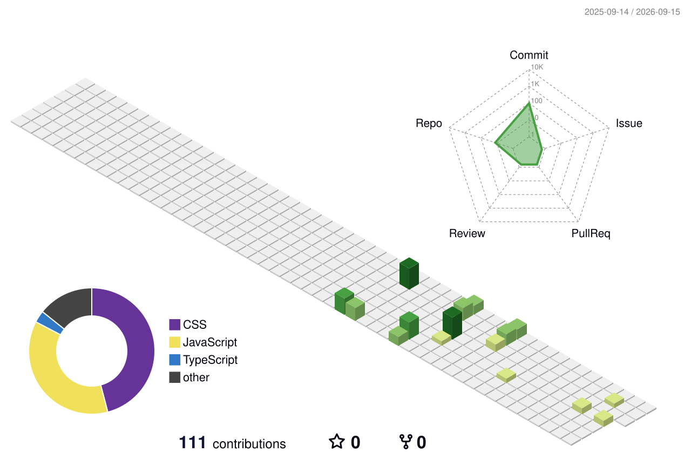

<p align="center">
  
</p>

<h1 align="center">PANVITHA CHOWDARY</h1>

<p align="center">
  AI Engineer • Full Stack Developer • SaaS Builder
</p>

<p align="center">
  
  
</p>

---

## PLAYER STATUS

```yaml
Player: Panvitha Chowdary
Class: AI Engineer + Full Stack Developer
Level: B.Tech CSE
XP: Building Real-World Applications

Focus:
  - Artificial Intelligence
  - Full Stack Development
  - SaaS Products

Learning:
  - System Design
  - Backend Architecture
  - Cloud Technologies
  - Advanced AI Engineering

Status: ACTIVE
```

---

## CURRENT QUESTS

```yaml
✓ Building scalable AI applications
✓ Designing modern full stack systems
✓ Exploring AI integrations
✓ Strengthening backend engineering skills
✓ Solving Data Structures and Algorithms problems
✓ Building production-ready applications
```

---


## 3D CONTRIBUTION GRAPH

<p align="center">
  
</p>

---

## FEATURED PROJECTS


### ResumeAI

AI-powered resume intelligence platform featuring ATS analysis, job-description matching, cover letter generation, resume improvement, and interview preparation.

**Focus:** `AI` `NLP` `Full Stack` `Career Tech`

---

### AlgoVision

Interactive Data Structures and Algorithms visualizer featuring sorting algorithms, graphs, trees, BFS, DFS, Merge Sort, Quick Sort, and algorithm recommendations.

**Focus:** `Algorithms` `Visualization` `JavaScript` `Education`

---

### The Gifting Co.

AI-powered personalized gifting platform that recommends thoughtful gifts based on relationship, occasion, interests, budget, and shopping preferences, with real product links and nearby offline store discovery.

**Focus:** `AI` `React` `Node.js` `APIs` `E-Commerce`

---

## ACHIEVEMENTS

```text
[UNLOCKED]

+ Built AI-powered products
+ Built Full Stack SaaS applications
+ Integrated LLMs into real projects
+ Developed production-ready applications
+ Practiced Data Structures and Algorithms
+ Explored AI agents and automation
```

---

## GAME LOG

```bash
[LEVEL UP]

+ Built AI-powered products
+ Built Full Stack SaaS applications
+ Integrated LLMs into real projects
+ Developed and deployed production-ready systems

[CURRENT OBJECTIVES]

> Build impactful software
> Learn continuously
> Strengthen engineering skills
> Ship consistently
> Reach the next high score
```

---

## CONNECT

<p align="center">

<a href="https://github.com/panvithachowdary">
  
</a>

<a href="https://linkedin.com/in/panvitha-chowdary">
  
</a>

</p>

---

<p align="center">
  <b>BUILD. LEARN. SOLVE. SHIP.</b>
</p>
